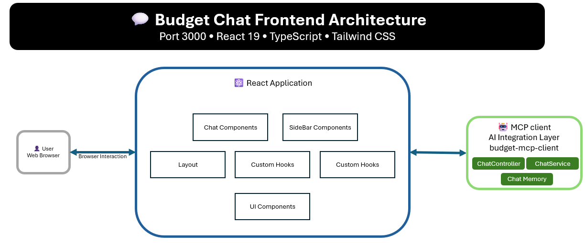

# 💬 Budget Chat Frontend

A **React TypeScript frontend** that provides an intuitive chat interface for conversational budget management. Users can interact with their budgets using natural language through an AI-powered chat assistant.

## 🎯 Purpose

The Budget Chat Frontend serves as the **user interface layer** for the budget management system. It provides:
- 💬 Conversational chat interface for budget management
- 📱 Responsive design for desktop and mobile devices
- 📊 Real-time budget statistics and quick actions
- 🎨 Modern UI with Tailwind CSS and Lucide icons
- 📋 Rich markdown support for formatted responses

## 🏗️ Architecture Diagram



## 🛠️ Technologies & Frameworks

| Category | Technology | Version | Purpose |
|----------|------------|---------|---------|
| **Frontend Framework** | React | 19.1.0 | UI library |
| **Language** | TypeScript | 4.9.5 | Type-safe JavaScript |
| **Styling** | Tailwind CSS | 3.4.17 | Utility-first CSS framework |
| **Icons** | Lucide React | 0.511.0 | Beautiful icon library |
| **Markdown** | React Markdown | 10.1.0 | Rich text rendering |
| **Markdown Extensions** | Remark GFM | 4.0.1 | GitHub Flavored Markdown |
| **Build Tool** | React Scripts | 5.0.1 | Build configuration |
| **Testing** | React Testing Library | 16.3.0 | Component testing |
| **Testing** | Jest | 27.5.2 | JavaScript testing framework |
| **Package Manager** | npm | Latest | Dependency management |

## 🎨 Features & Components

### Core Components

#### 1. Chat Interface
- **ChatArea**: Main chat display with message history
- **ChatInput**: Message input with send functionality
- **ChatMessage**: Individual message rendering with markdown support

#### 2. Sidebar
- **QuickStats**: Real-time budget statistics
- **QuickActions**: Predefined action buttons
- **ExampleCommands**: Sample commands for user guidance

#### 3. Layout
- **Header**: Application title and branding
- **Responsive Design**: Mobile-first approach with collapsible sidebar

### Key Features

✅ **Real-time Chat**: Instant messaging with AI assistant  
✅ **Markdown Support**: Rich text formatting in responses  
✅ **Mobile Responsive**: Works seamlessly on all devices  
✅ **Quick Actions**: One-click budget operations  
✅ **Loading States**: Visual feedback during operations  
✅ **Error Handling**: Graceful error display and recovery  
✅ **Memory Management**: Clear chat history functionality  

## 🚀 Setup & Installation

### Prerequisites
- 📦 **Node.js** 16+ and npm
- 🔗 **Budget MCP Client** running on port 8080
- 🐳 **Docker** (optional)

### Method 1: Local Development

1. **Clone and navigate to the project:**
   ```bash
   cd budget-chat-frontend
   ```

2. **Install dependencies:**
   ```bash
   npm install
   ```

3. **Set up environment variables:**
   Create `.env` file:
   ```env
   REACT_APP_API_URL=http://localhost:8080
   REACT_APP_APP_NAME=Budget Chat Assistant
   ```

4. **Ensure Backend is running:**
   ```bash
   curl http://localhost:8080/actuator/health
   ```

5. **Start the development server:**
   ```bash
   npm start
   ```

6. **Open in browser:**
   Navigate to `http://localhost:3000`

### Method 2: Docker

1. **Build the Docker image:**
   ```bash
   docker build -t budget-chat-frontend .
   ```

2. **Run the container:**
   ```bash
   docker run -p 3000:80 budget-chat-frontend
   ```

### Method 3: Production Build

1. **Create production build:**
   ```bash
   npm run build
   ```

2. **Serve static files:**
   ```bash
   npx serve -s build -l 3000
   ```

## 📱 User Interface Guide

### Chat Interface

1. **Send Messages**: Type in the input field and press Enter or click Send
2. **View History**: Scroll up to see previous conversations
3. **Quick Actions**: Use sidebar buttons for common operations
4. **Clear Memory**: Reset conversation context using the clear button

### Example Commands

Try these sample commands in the chat:

```
Create a budget for groceries with $500 monthly limit
Add expense of $45.50 for grocery shopping in food category
Show me all my budgets
How much have I spent this month?
Add income of $3000 from salary
Get my recent transactions
```

### Quick Actions

The sidebar provides one-click actions for:
- 📊 View all budgets
- 💰 Add income
- 💸 Add expense
- 📈 Monthly summary
- 📝 Recent transactions
- 🧹 Clear chat memory

## 🎨 Customization

### Styling

The application uses Tailwind CSS for styling. Customize the design by modifying:

- **Colors**: Update Tailwind config in `tailwind.config.js`
- **Components**: Edit component-specific styles in individual files
- **Global Styles**: Modify `src/index.css` for global changes

### Configuration

Update application settings in `.env`:

```env
# API Configuration
REACT_APP_API_URL=http://localhost:8080
```

## 🔧 Development

### Project Structure

```
src/
├── components/          # Reusable React components
│   ├── Chat/           # Chat-related components
│   ├── Layout/         # Layout components
│   ├── Sidebar/        # Sidebar components
│   └── UI/             # Base UI components
├── hooks/              # Custom React hooks
├── services/           # API service layer
├── types/              # TypeScript type definitions
├── utils/              # Utility functions
└── App.tsx            # Main application component
```

### Adding New Components

1. **Create component file:**
   ```typescript
   // src/components/YourComponent/YourComponent.tsx
   import React from 'react';

   interface YourComponentProps {
     // Define props
   }

   export const YourComponent: React.FC<YourComponentProps> = (props) => {
     return (
       <div>
         {/* Component JSX */}
       </div>
     );
   };
   ```

2. **Add to exports:**
   ```typescript
   // src/components/index.ts
   export { YourComponent } from './YourComponent/YourComponent';
   ```

### API Integration

The frontend communicates with the backend through the API service:

```typescript
// src/services/api.ts
export const apiService = {
  sendMessage: async (message: string): Promise<ChatResponse> => {
    // Implementation
  },
  getBudgetSummary: async (): Promise<BudgetSummaryResponse> => {
    // Implementation
  }
};
```

## 🐛 Troubleshooting

| Issue | Solution |
|-------|----------|
| **App won't start** | Check Node.js version (16+) and run `npm install` |
| **API connection failed** | Verify backend is running on port 8080 |
| **Port 3000 in use** | Use `PORT=3001 npm start` to run on different port |
| **Build fails** | Clear cache with `npm run build -- --reset-cache` |
| **TypeScript errors** | Run `npm run type-check` to see detailed errors |
| **Styling issues** | Ensure Tailwind CSS is properly configured |
