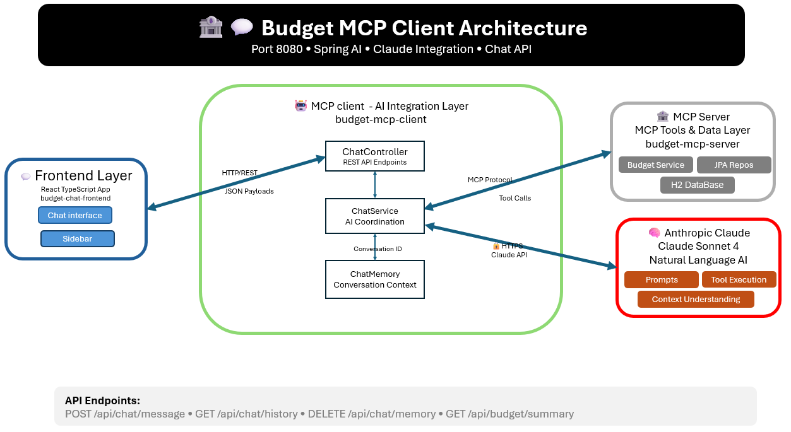

# 🤖 Budget MCP Client

A **Spring Boot MCP (Model Context Protocol) Client** that integrates with Anthropic Claude AI to provide conversational budget management capabilities. This client connects to the Budget MCP Server and enables natural language interactions with budget data.

## 🎯 Purpose

The Budget MCP Client serves as the **AI integration layer** for the budget management system. It provides:
- 🧠 Anthropic Claude AI integration
- 💬 RESTful chat API for frontend applications
- 🔗 MCP protocol communication with budget server
- 💭 Chat memory management for conversational context
- 📊 Structured data responses for dashboard integration

## 🏗️ Architecture Diagram



## 🛠️ Technologies & Frameworks

| Category | Technology | Version | Purpose |
|----------|------------|---------|---------|
| **Framework** | Spring Boot | 3.5.0 | Core application framework |
| **Language** | Java | 21 | Programming language |
| **AI Integration** | Spring AI | 1.0.0 | Claude API integration |
| **AI Provider** | Anthropic Claude | Sonnet 4 | Large language model |
| **MCP Client** | Spring AI MCP | 1.0.0 | MCP protocol client |
| **Web Framework** | Spring Web | 6.2.7 | REST API development |
| **Validation** | Spring Validation | 3.5.0 | Input validation |
| **JSON Processing** | Jackson | 2.19.0 | JSON serialization |
| **Utilities** | Lombok | 1.18.38 | Code generation |
| **Testing** | Spring Boot Test | 3.5.0 | Testing framework |
| **Build Tool** | Maven | 3.x | Dependency management |

## 🔌 Available API Endpoints

### Chat Endpoints

#### 1. Send Chat Message
```http
POST /api/chat/message
Content-Type: application/json

{
  "message": "Create a budget for groceries with $500 limit"
}
```

**Response:**
```json
{
  "response": "✅ Budget created successfully!\n📋 Category: groceries\n💰 Monthly Limit: $500.00\n📅 Period: 6/2025\n⚠️ Alert Threshold: 80.0%\n📝 Notes: None",
  "timestamp": "2025-06-08T15:30:00"
}
```

#### 2. Get Chat History
```http
GET /api/chat/history
```

**Response:**
```json
{
  "messages": [
    {
      "role": "user",
      "content": "Show me all my budgets",
      "timestamp": "2025-06-08T15:25:00"
    },
    {
      "role": "assistant", 
      "content": "📋 **Current Active Budgets:**\n\n✅ **Groceries**\n  💰 Budget: $500.00\n  💸 Spent: $120.50 (24.1%)\n  💵 Remaining: $379.50",
      "timestamp": "2025-06-08T15:25:01"
    }
  ]
}
```

#### 3. Clear Chat Memory
```http
DELETE /api/chat/memory
```

**Response:**
```json
{
  "message": "Chat memory cleared successfully"
}
```

### Budget Summary Endpoints

#### 4. Get Budget Summary
```http
GET /api/budget/summary?year=2025&month=6
```

**Response:**
```json
{
  "summary": {
    "totalIncome": 3000.00,
    "totalExpenses": 1250.75,
    "netAmount": 1749.25
  }
}
```

## 🚀 Setup & Installation

### Prerequisites
- ☕ **Java 21** or higher
- 📦 **Maven 3.6+**
- 🔑 **Anthropic API Key**
- 🐳 **Docker** (optional)
- 🏦 **Budget MCP Server** running on port 8081

### Method 1: Local Development

1. **Clone and navigate to the project:**
   ```bash
   cd budget-mcp-client
   ```

2. **Set up environment variables:**
   ```bash
   export ANTHROPIC_API_KEY=your_api_key_here
   ```
   
   Or create `src/main/resources/application-local.yml`:
   ```yaml
   spring:
     ai:
       anthropic:
         api-key: your_api_key_here
   ```

3. **Install dependencies:**
   ```bash
   mvn clean install
   ```

4. **Ensure Budget MCP Server is running:**
   ```bash
   curl http://localhost:8081/actuator/health
   ```

5. **Run the application:**
   ```bash
   mvn spring-boot:run
   ```

6. **Verify the client is running:**
   ```bash
   curl http://localhost:8080/actuator/health
   ```

### Method 2: Docker

1. **Build the Docker image:**
   ```bash
   docker build -t budget-mcp-client .
   ```

2. **Run the container:**
   ```bash
   docker run -p 8080:8080 \
     -e ANTHROPIC_API_KEY=your_api_key_here \
     budget-mcp-client
   ```

### Configuration

The client can be configured through `application.yml`:

```yaml
server:
  port: 8080

spring:
  application:
    name: budget-mcp-client
  
  ai:
    anthropic:
      api-key: ${ANTHROPIC_API_KEY}
      chat:
        options:
          model: claude-sonnet-4-20250514
          temperature: 0.7
          max-tokens: 2000
    
    mcp:
      client:
        enabled: true
        type: ASYNC
        request-timeout: 30s
        sse:
          connections:
            budget-server:
              url: http://localhost:8081
              sse-endpoint: /sse
```

## 🧪 Testing

### Unit Tests
```bash
mvn test
```

### Integration Tests
```bash
mvn verify
```

### Manual API Testing

#### Test Chat Functionality
```bash
curl -X POST http://localhost:8080/api/chat/message \
  -H "Content-Type: application/json" \
  -d '{"message": "Show me all my budgets"}'
```

#### Test Budget Summary
```bash
curl http://localhost:8080/api/budget/summary
```

#### Test Memory Management
```bash
curl -X DELETE http://localhost:8080/api/chat/memory
```

### Test AI Integration

1. **Create a budget via chat:**
   ```bash
   curl -X POST http://localhost:8080/api/chat/message \
     -H "Content-Type: application/json" \
     -d '{"message": "Create a budget for food with $600 monthly limit"}'
   ```

2. **Add a transaction:**
   ```bash
   curl -X POST http://localhost:8080/api/chat/message \
     -H "Content-Type: application/json" \
     -d '{"message": "Add expense of $45.50 for grocery shopping in food category"}'
   ```

3. **Check spending:**
   ```bash
   curl -X POST http://localhost:8080/api/chat/message \
     -H "Content-Type: application/json" \
     -d '{"message": "How much have I spent on food this month?"}'
   ```

## 💭 Chat Memory Configuration

The client supports configurable chat memory for maintaining conversation context:

```java
@Bean
public ChatMemory chatMemory() {
    return MessageWindowChatMemory.builder()
        .maxMessages(50)  // Keep last 50 messages
        .build();
}
```

## 🔧 Development

### Adding New API Endpoints

To add new endpoints, create methods in `ChatController`:

```java
@PostMapping("/your-endpoint")
public ResponseEntity<YourResponse> yourEndpoint(@RequestBody YourRequest request) {
    // Implementation
    return ResponseEntity.ok(response);
}
```

### Customizing AI Behavior

Modify the chat service to customize AI responses:

```java
@Service
public class ChatService {
    public String chat(String message) {
        return chatClient
            .prompt()
            .user(message)
            .system("You are a helpful budget assistant...")
            .call()
            .content();
    }
}
```

## 🐛 Troubleshooting

| Issue | Solution |
|-------|----------|
| **API Key not found** | Set `ANTHROPIC_API_KEY` environment variable |
| **MCP Server connection failed** | Ensure Budget MCP Server is running on port 8081 |
| **Port 8080 in use** | Change `server.port` in `application.yml` |
| **Memory issues** | Adjust chat memory size in configuration |
| **Timeout errors** | Increase `request-timeout` in MCP client config |

## 📊 Monitoring

- **Health Check**: `http://localhost:8080/actuator/health`
- **Application Info**: `http://localhost:8080/actuator/info`
- **Metrics**: `http://localhost:8080/actuator/metrics`

---

## 📝 License

This project is part of the Budget Management System and is intended for educational and demonstration purposes.
