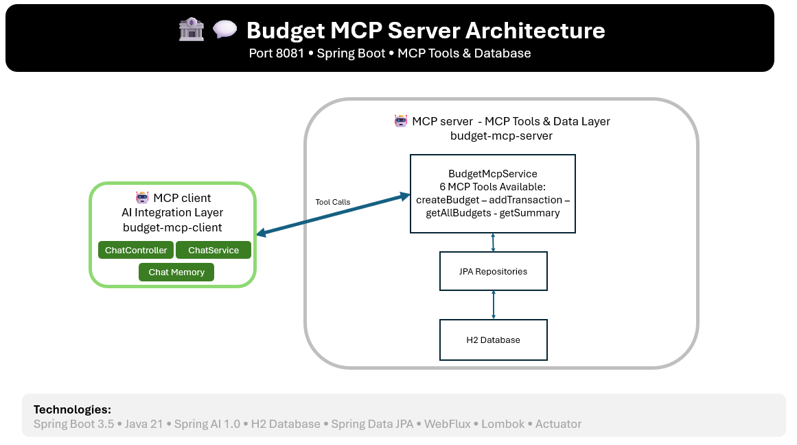

# 🏦 Budget MCP Server

A **Spring Boot MCP (Model Context Protocol) Server** that provides AI-accessible budget management tools and resources. This server exposes budget operations as MCP tools that can be invoked by AI systems like Claude through the MCP protocol.

## 🎯 Purpose

The Budget MCP Server acts as the **backend data management layer** for the budget management system. It provides:
- 📊 Budget creation and management tools
- 💰 Transaction tracking and categorization
- 📈 Spending analysis and reporting
- 🔧 MCP tool endpoints for AI integration
- 💾 H2 in-memory database for data persistence

## 🏗️ Architecture Diagram



## 🛠️ Technologies & Frameworks

| Category | Technology | Version | Purpose |
|----------|------------|---------|---------|
| **Framework** | Spring Boot | 3.5.0 | Core application framework |
| **Language** | Java | 21 | Programming language |
| **AI Integration** | Spring AI | 1.0.0 | MCP server implementation |
| **Database** | H2 Database | 2.3.232 | In-memory data storage |
| **ORM** | Spring Data JPA | 3.5.0 | Data access layer |
| **Reactive** | Spring WebFlux | 6.2.7 | Non-blocking I/O |
| **Validation** | Spring Validation | 3.5.0 | Input validation |
| **Utilities** | Lombok | 1.18.38 | Code generation |
| **Monitoring** | Spring Actuator | 3.5.0 | Application monitoring |
| **Build Tool** | Maven | 3.x | Dependency management |

## 🔌 Available MCP Tools

The server exposes the following tools through the MCP protocol:

### 1. Create Budget
```json
{
  "name": "createBudget",
  "description": "Create a new budget for a category with monthly limit and alert threshold",
  "parameters": {
    "category": "string",
    "monthlyLimit": "number",
    "year": "number (optional)",
    "month": "number (optional)",
    "notes": "string (optional)",
    "alertThreshold": "number (optional, default: 80)"
  }
}
```

### 2. Add Transaction
```json
{
  "name": "addTransaction",
  "description": "Add a new income or expense transaction",
  "parameters": {
    "amount": "number",
    "description": "string",
    "category": "string",
    "type": "INCOME|EXPENSE",
    "date": "YYYY-MM-DD (optional)"
  }
}
```

### 3. Get All Budgets
```json
{
  "name": "getAllBudgets",
  "description": "Get all active budgets with current spending status"
}
```

### 4. Get Spending Summary
```json
{
  "name": "getSpendingSummary",
  "description": "Get spending summary for a specific month or category",
  "parameters": {
    "category": "string (optional)",
    "year": "number (optional)",
    "month": "number (optional)"
  }
}
```

### 5. Get Recent Transactions
```json
{
  "name": "getRecentTransactions",
  "description": "Get recent transactions (last 10)"
}
```

### 6. Get Summary
```json
{
  "name": "getSummary",
  "description": "Get budget summary with totals as structured data",
  "parameters": {
    "year": "number (optional)",
    "month": "number (optional)"
  }
}
```

## 🚀 Setup & Installation

### Prerequisites
- ☕ **Java 21** or higher
- 📦 **Maven 3.6+**
- 🐳 **Docker** (optional)

### Method 1: Local Development

1. **Clone and navigate to the project:**
   ```bash
   cd budget-mcp-server
   ```

2. **Install dependencies:**
   ```bash
   mvn clean install
   ```

3. **Run the application:**
   ```bash
   mvn spring-boot:run
   ```

4. **Verify the server is running:**
   ```bash
   curl http://localhost:8081/actuator/health
   ```

### Method 2: Docker

1. **Build the Docker image:**
   ```bash
   docker build -t budget-mcp-server .
   ```

2. **Run the container:**
   ```bash
   docker run -p 8081:8081 budget-mcp-server
   ```

### Configuration

The server can be configured through `application.yml`:

```yaml
server:
  port: 8081

spring:
  application:
    name: budget-mcp-server
  
  datasource:
    url: jdbc:h2:mem:budgetdb
    driver-class-name: org.h2.Driver
    username: sa
    password: ""
  
  ai:
    mcp:
      server:
        name: budget-mcp-server
        version: 1.0.0
        type: ASYNC
```

## 🧪 Testing

### Unit Tests
```bash
mvn test
```

### Integration Tests
```bash
mvn verify
```

### Manual Testing with H2 Console

1. Access H2 Console: http://localhost:8081/h2-console
2. Use connection URL: `jdbc:h2:mem:budgetdb`
3. Username: `sa`, Password: (empty)

### Test MCP Tools

The server provides an actuator endpoint to inspect available tools:
```bash
curl http://localhost:8081/actuator/mcp-tools
```

## 📊 Monitoring & Health

- **Health Check**: `http://localhost:8081/actuator/health`
- **Application Info**: `http://localhost:8081/actuator/info`
- **MCP Tools**: `http://localhost:8081/actuator/mcp-tools`
- **H2 Console**: `http://localhost:8081/h2-console`

## 🔧 Development

### Database Schema

The server automatically creates the following entities:

- **Budget**: Category-based monthly budgets with limits and thresholds
- **Transaction**: Income/expense transactions with categories and dates

### Adding New MCP Tools

To add new MCP tools, annotate methods in `BudgetMcpService` with `@Tool`:

```java
@Tool(description = "Your tool description")
public String yourNewTool(
    @ToolParam(description = "Parameter description") String param) {
    // Implementation
    return "Result";
}
```

## 🐛 Troubleshooting

| Issue | Solution |
|-------|----------|
| **Port 8081 in use** | Change `server.port` in `application.yml` |
| **Database connection error** | Ensure H2 is properly configured |
| **MCP tools not available** | Check `@Tool` annotations and service registration |
| **Memory issues** | Increase JVM heap size: `-Xmx512m` |

---
